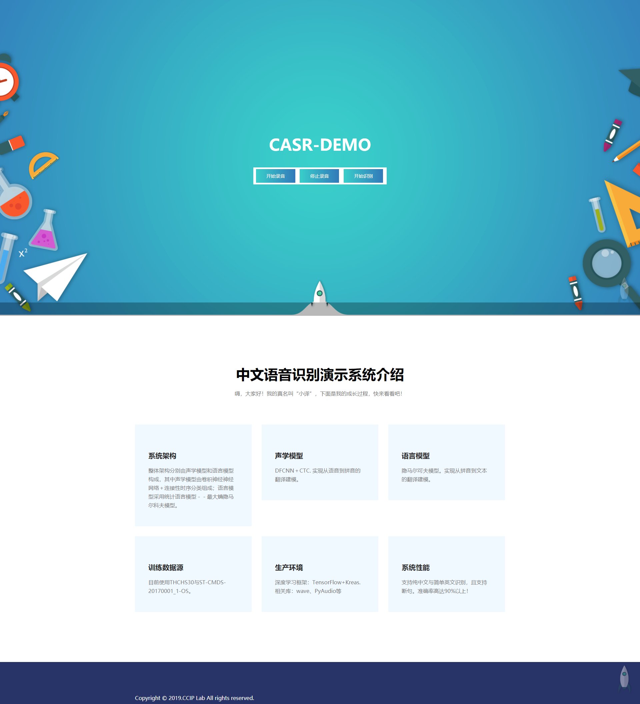
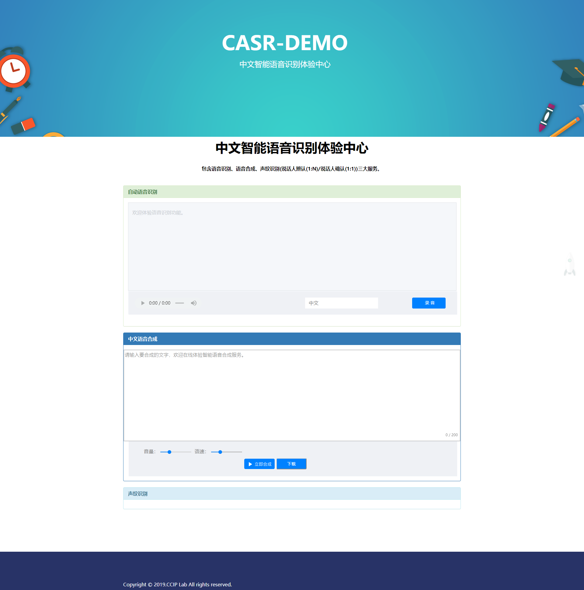

# CASR-DEMO(中文自动语音识别演示系统）
## 关于本项目的一些说明
> 首先，欢迎大家关注项目，进行学习研究。收到一些小伙伴的问题我就集中回答下，这里是demo的源码、有两个版本其一是名为speech_env,这是一个简单的语音识别功能，界面如下面的效果图一；还有一个是V2.0的目录，这个版本功能比较齐全，界面如效果图二。大家感兴趣在自己机器上试试的话我推荐直接使用v2.0版本，还有一点项目只在win10平台上测试过，其他不保证能不能运行。由于月久失更，有些依赖包可能需要修改，不过应该都是小问题，根据实际过程的报错信息修复就行。再次感谢大家的关注！
## 最新整理了两个版本的发布版
- [点此处详见](https://github.com/lihanghang/CASR-DEMO/releases)
## speech_env（效果图一）  
 
## speechV2.0 基于第三方接口实现语音识别和语音合成、说话人识别功能(效果图二)  

---
wechat:LHH754086474  
[CSDN](https://blog.csdn.net/lihangll)  
Updated on December 25,2019.

